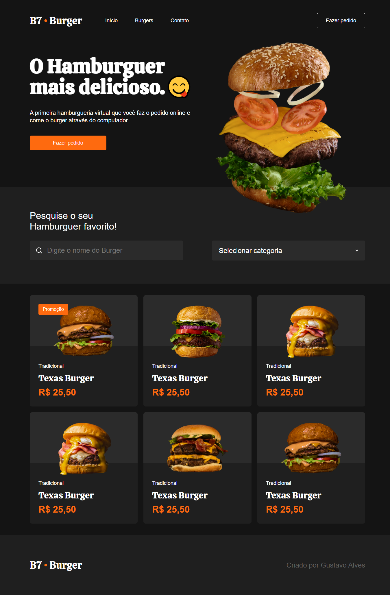

# 🚀 B7Burger

**Landing page de lanchonete, construida com HTML & CSS (Grid e Flexbox), com design responsivo - projeto do curso B7Web.**

## 📋 Índice

1. [Sobre o Projeto](#-sobre-o-projeto)
2. [Demonstração](#-demonstração)
3. [Funcionalidades](#-funcionalidades)
4. [Tecnologias Utilizadas](#-tecnologias-utilizadas)
5. [Como Executar Localmente](#-como-executar-localmente)
6. [Personalização & Próximos Passos](#-personalização-próximos-passos)
7. [Contribuições](#-contribuições)
8. [Licença](#-licença)
9. [Contato](#-contato)

---

## 📖 Sobre o Projeto

O **B7Burger** é uma página de apresentação moderna e responsiva para uma lanchonete fictícia, desenvolvida como projeto do curso de HTML e CSS da B7Web. O foco está em:

- Layout flexível e visual atraente utilizando CSS Grid e Flexbox.
- Compatibilidade com diferentes tamanhos de tela.
- Estrutura simples e limpa, ideal para portfólios ou base para futuros projetos.

---

## 🎥 Demonstração



---

## ✨ Funcionalidades

- Layout responsivo que se adapta de mobile a desktop.
- Uso combinado de **CSS Grid** e **Flexbox** para posicionamento e alinhamento.
- Seções típicas de uma landing page: cabeçalho, apresentação, menu, rodapé.
- Estrutura HTML semântico e CSS modularizado.

---

## 🛠 Tecnologias Utilizadas

- **HTML5**
- **CSS3** (incluindo Grid e Flexbox)

---

## ▶ Como Executar Localmente

1. Clone o repositório:

    ```bash
    git clone https://github.com/gustavoalvesdev/b7burger.git
    cd b7burger
    ```

2. Abra o arquivo `index.html` no navegador.
3. Para desenvolvimento contínuo, pode usar uma extensão como __Live Server__ no VS Code.

---

## 🎨 Personalização & Próximos Passos

- **Alterar branding**: ajuste texto, cores, fontes, imagens, para dar a cara da sua marca.
- **Adicionar interatividade**: criar menu mobile, animações possíveis com JS puro ou frameworks.
- **Formulário de contato ou pedido**: uma forma legal de incluir dinamismo.
- **Publicação online**: hospeda no GitHub Pages ou outro serviço gratuito.

---

## 🤝 Contribuições

Contribuições são bem-vindas! Se quiser colaborar, por favor:

1. Faça um fork do repositório.
2. Crie uma branch com o recurso/correção (`feature/funcionalidade-x`) .
3. Faça commit das suas alterações.
4. Envive um pull request explicandoas mudanças.
5. Aguarde review e integração com carinho! ️️❤️

---

## 📜 Licença

Este projeto está licenciado sob a **MIT License** - sinta-se à vontade para usar, modificar e compartilhar.
Veja o arquivo [LICENSE](LICENSE) para mais detalhes.

---

## 📬 Contato

Desenvolvido por **Gustavo Alves**.
Fique à vontade para me encontrar no GitHub ou outras redes sociais:

- GitHub: [gustavoalvesdev](https://github.com/gustavoalvesdev)
- E-mail: `gustavoalvesdasilva@outlook.com` 
- Linkedin: [devgugaofc](https://linkedin.com/in/devgugaofc)
- Instagram: [devgugaofc](https://instagram.com/devgugaofc)
- Facebook: [devgugaofc](https://facebook.com/devgugaofc)
- YouTube: [devgugaofc](https://youtube.com/@devgugaofc)
- X: [devgugaofc](https:/x.com/devgugaofc)